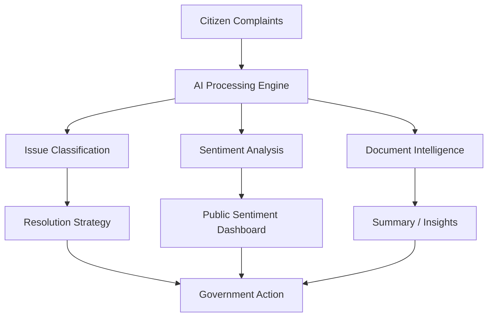
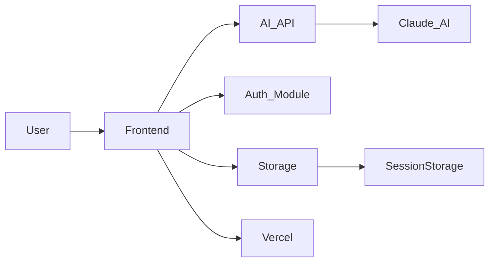

# 🇮🇳 Mantri Mitra AI
### Ministerial Intelligence Assistant for Public Leaders


---

## 🏛 Overview

**Mantri Mitra AI** is an AI-powered digital assistant designed to support **Indian MLAs, MPs, and government administrators** in managing constituency issues, documents, and public communication.

The platform functions as a **governance intelligence system** that helps leaders:

- analyze citizen complaints
- summarize government documents
- generate official speeches
- manage meetings
- gain insights from constituency data

The goal is to enable **faster, smarter, and more transparent governance.**

---

# 🎯 Vision

Public leaders receive thousands of:

- complaints
- reports
- documents
- meeting discussions

Managing this information manually is difficult.

**Mantri Mitra AI transforms governance workflows using Artificial Intelligence**, allowing decision-makers to focus on solving problems instead of processing information.

---

# 🚀 Core Features

## 📊 Constituency Issue Tracker
Track citizen complaints and automatically generate **AI-based resolution strategies**.

## 📄 Document Intelligence
Upload government files and instantly:

- Summarize documents
- Translate documents
- Ask questions about the content
- Generate official briefing notes

## 🗣 Speech Generator
Create speeches and public announcements in **multiple Indian languages**.

## 📝 Meeting Intelligence
Generate:

- Meeting agenda
- Summary notes
- Key decisions
- Action points

## 📈 Governance Dashboard
Visual insights for:

- Public sentiment
- Issue trends
- Administrative priorities

## 🔐 Secure Authentication
Secure login using **SHA-256 hashing with Web Crypto API**.

## 📱 Mobile Friendly
Fully responsive for:

- Desktop
- Tablet
- Mobile devices

## 🌙 Dark Mode
Modern UI with built-in dark mode.

---

# 🧠 AI Workflow



---

# 🏗 System Architecture



---

# 🧰 Technology Stack

| Layer | Technology |
|------|-------------|
| Frontend | React 18 |
| Build Tool | Vite |
| AI Engine | Claude (Anthropic) |
| Styling | CSS |
| Authentication | Web Crypto API |
| Storage | sessionStorage |
| Deployment | Vercel |
| Fonts | Google Fonts |

---

# 📁 Project Structure

```
mantri-mitra-ai/
│
├── index.html
├── package.json
├── vite.config.js
├── vercel.json
├── .env.example
├── .gitignore
│
└── src/
    ├── main.jsx
    └── App.jsx
```

---

# ⚙️ Local Development

Install dependencies

```bash
npm install
```

Create environment file

```
.env.local
```

Add your API key

```
VITE_ANTHROPIC_KEY=your_api_key_here
```

Start development server

```bash
npm run dev
```

Open in browser

```
http://localhost:3000
```

---

# 🌐 Deployment

### Deploy using Vercel

1. Upload project to GitHub
2. Open **vercel.com**
3. Import GitHub repository
4. Add environment variable:

```
VITE_ANTHROPIC_KEY
```

5. Click **Deploy**

The application will be live in a few minutes.

---

# 🖼 Feature Screenshots

You can add screenshots here after deployment.

```
/screenshots
   dashboard.png
   speech-generator.png
   issue-tracker.png
```

Example:

```

```

---

# 🎯 Use Cases

Mantri Mitra AI can assist:

- Members of Parliament (MPs)
- Members of Legislative Assembly (MLAs)
- District Magistrates
- Government Officers
- Policy Analysts
- Civic Governance Platforms

---

# ⚠️ Production Recommendations

For real government deployment:

- Move AI API calls to **backend server**
- Implement **database storage**
- Use **role-based authentication**
- Enable **secure logging**
- Integrate **government data APIs**

---

# 🤝 Contributing

Contributions are welcome.

Steps to contribute:

1. Fork the repository
2. Create a new branch
3. Commit your changes
4. Submit a pull request

---

# 📜 License

This project is licensed under the **MIT License**.

---

# 👨‍💻 Developed By

## 🚀 Team Daksha

A technology team focused on building **AI-powered solutions for governance, public systems, and digital administration.**

---

# 🇮🇳 Motto

**सत्यमेव जयते**  
Truth Alone Triumphs

---

⭐ If you find this project useful, please consider giving the repository a **star**.
